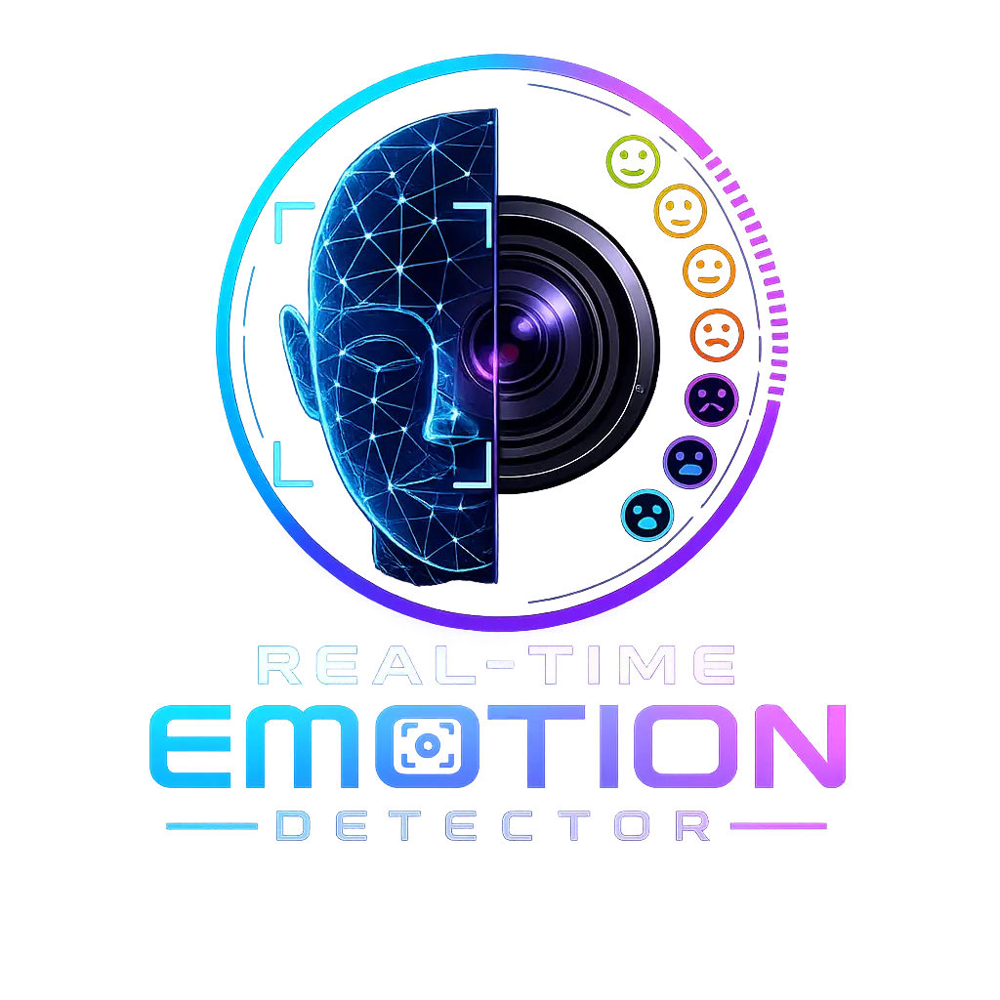
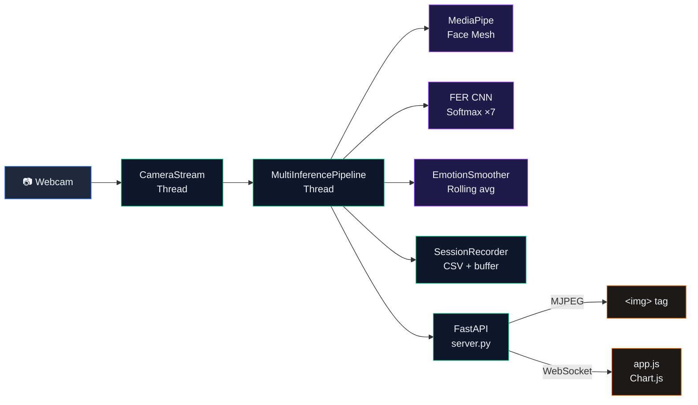

<div align="center">



<h1>Real-Time Emotion Detector</h1>

<p>A production-ready AI system that detects multiple faces simultaneously, classifies their expressions in real-time using a deep CNN, and streams live annotated video + emotion analytics to a web dashboard — at 30 fps.</p>

<br/>

[](.)
[](https://python.org)
[](https://fastapi.tiangolo.com)
[](https://tensorflow.org)
[](https://mediapipe.dev)
[](https://opencv.org)
[](LICENSE)
[](tests/)

<br/>

[**🚀 Quick Start**](#-quick-start) &nbsp;·&nbsp; [**🧠 How It Works**](#-how-it-works) &nbsp;·&nbsp; [**⚙️ Configuration**](#%EF%B8%8F-configuration) &nbsp;·&nbsp; [**📁 Project Structure**](#-project-structure)

</div>

---

## ✨ Features

<table>
<tr>
<td width="50%">

**🎭 Multi-Face Tracking**
Detects and individually tracks up to 5 faces simultaneously with persistent IDs across frames using centroid-based IoU matching.

**🧠 Hybrid AI Analysis**
Combines a Keras CNN (FER / TensorFlow) with geometric heuristics from MediaPipe's 468-point face mesh for robust classification.

**📡 Real-Time MJPEG Streaming**
Annotated video streamed to the browser as a standard HTTP multipart stream — no plugins, no WebRTC complexity.

</td>
<td width="50%">

**⚡ WebSocket Analytics**
Structured JSON payloads (FPS, faces, chart history, session stats) pushed to the dashboard every single frame.

**📊 Session Recording**
All emotion data automatically logged to a timestamped CSV in `sessions/`. One-click export from the dashboard.

**🔌 Pluggable Model Backend**
Switch between `fer` (fast, default) and `deepface` (higher accuracy) with one line in `config.yaml`.

</td>
</tr>
</table>

---

## 🧠 How It Works

```
📷 Webcam  ──►  [Thread: CameraStream]  ──►  ring buffer (non-blocking)
                                                    │
                                                    ▼
                              [Thread: MultiInferencePipeline]
                                   │
                    ┌──────────────┼──────────────┐
                    ▼              ▼               ▼
              MediaPipe       FER CNN          Heuristic
              Face Mesh    (TensorFlow)         Nudge
             468 landmarks   Softmax ×7      smile/mouth
             bbox + ratios   probabilities    geometry
                    └──────────────┼──────────────┘
                                   ▼
                            EmotionSmoother
                           Rolling average
                           (window = 8 frames)
                                   │
                    ┌──────────────┴──────────────┐
                    ▼                             ▼
           session_recorder.py              server.py (FastAPI)
             CSV + chart buffer              │              │
                                      MJPEG stream    WebSocket
                                      /video_feed        /ws
                                            │              │
                                        tag      Chart.js
                                      Live video    Live dashboard
```

### Pipeline Stages

| Stage | File | What Happens |
| :--- | :--- | :--- |
| **Capture** | `camera_stream.py` | Background thread reads webcam into a ring buffer via `cv2.VideoCapture`. Main thread never blocks on I/O. |
| **Face Mesh** | `face_landmarks.py` | MediaPipe builds a 468-point 3D mesh per face. Extracts bounding box + `mouth_open_ratio` and `smile_ratio` from specific landmarks (#13, #14, #61, #291). |
| **Tracking** | `multi_face_pipeline.py` | `FaceTracker` matches faces across frames via centroid Euclidean distance. Each face gets a persistent integer ID and its own `EmotionSmoother`. |
| **Inference** | `model_backend.py` | Face crop → grayscale → 64×64 → normalize → Keras forward pass → softmax over 7 emotions. Runs every `skip_frames` frames. |
| **Nudge** | `model_backend.py` | Boosts emotion scores using geometry: wide smile → `happy +0.10`, open mouth → `surprise +0.08`, drooping corners → `sad +0.06`. Re-normalizes to sum to 1.0. |
| **Smoothing** | `smoothing.py` | `EmotionSmoother` maintains a rolling average over the last N frames using `collections.deque`. Eliminates flickering. |
| **Logging** | `session_recorder.py` | Thread-safe CSV append every frame. In-memory deque for live chart data. Cumulative counters for session stats. |
| **Broadcast** | `server.py` | MJPEG: annotated JPEG frames yielded via `multipart/x-mixed-replace`. WebSocket: JSON payload every frame with chart, faces, and stats. |

---

## 🏗️ Architecture



---

## 🚀 Quick Start

**Requirements:** Python 3.9–3.11 · Webcam · ~2 GB free disk (TensorFlow)

```bash
# Clone
git clone https://github.com/NaveedBhat/emotion_detector.git
cd emotion_detector

# Install
make install

# Run web dashboard
make serve
# → Open http://127.0.0.1:8080

# Or run desktop OpenCV window
make run
```

> **macOS:** Grant Terminal camera permission via **System Settings → Privacy & Security → Camera**

---

## ⚙️ Configuration

All tunables are in `config.yaml` — no source code changes needed.

```yaml
camera:
  index: 0          # Try 1, 2 if webcam not found
  width: 1280
  height: 720

inference:
  skip_frames: 2          # Run CNN every N frames (higher = faster, less responsive)
  smoothing_window: 8     # Rolling average window (higher = smoother, laggier)
  max_num_faces: 5
  model_backend: fer      # "fer" (default) | "deepface" (pip install deepface)

web:
  host: "127.0.0.1"
  port: 8080
  mjpeg_quality: 85       # JPEG quality 1-95

session:
  save_dir: sessions
  chart_window_seconds: 60

logging:
  level: INFO             # DEBUG | INFO | WARNING | ERROR
  log_to_file: true
  log_file: logs/emotion_detector.log
```

---

## 🖥️ CLI Reference

```bash
make install          # Create venv and install dependencies
make serve            # Start web dashboard at http://127.0.0.1:8080
make run              # Desktop OpenCV window
make debug            # Run with DEBUG logging
make test             # Run pytest suite
make lint             # Run flake8
make freeze           # Lock dependencies to requirements.lock
make clean            # Remove __pycache__ files

# main.py flags (desktop mode)
python main.py --camera 1              # Different webcam
python main.py --skip 3                # Run CNN every 3rd frame
python main.py --width 640 --height 480
python main.py --smoothing-window 12
python main.py --no-bars               # Hide probability bars panel
python main.py --no-history            # Hide emotion history strip
python main.py --debug
```

---

## 📁 Project Structure

```
emotion_detector/
├── server.py                   # FastAPI web server — MJPEG + WebSocket + CSV export
├── main.py                     # Desktop CLI — OpenCV window with full HUD
├── config.yaml                 # Central configuration file
├── Makefile                    # Developer commands
├── requirements.txt            # Pinned dependencies
├── requirements.lock           # Full frozen dependency tree
├── pyrightconfig.json          # Static type checker config
├── .gitignore                  # Excludes venv/, sessions/, logs/, cache
├── emotion.webp                # Project banner image (used in README)
│
├── src/
│   ├── constants.py            # EMOTIONS list (single source of truth)
│   ├── config.py               # AppConfig dataclasses + YAML loader
│   ├── camera_stream.py        # Threaded, non-blocking webcam capture
│   ├── face_landmarks.py       # MediaPipe FaceMesh → FaceGeometry dataclass
│   ├── model_backend.py        # FerBackend + DeepFaceBackend (pluggable ABC)
│   ├── smoothing.py            # EmotionSmoother — rolling average deque
│   ├── multi_face_pipeline.py  # FaceTracker + MultiInferencePipeline (web mode)
│   ├── pipeline.py             # InferencePipeline — single-face (desktop mode)
│   ├── emotion_analyzer.py     # Legacy single-face FER wrapper
│   ├── session_recorder.py     # Thread-safe CSV logger + chart buffer
│   └── overlay.py              # OpenCV HUD — corner brackets, bars, history strip
│
├── dashboard/
│   ├── index.html              # CSS Grid layout + Google Fonts
│   ├── style.css               # Glassmorphism dark theme + animations
│   └── app.js                  # WebSocket client + Chart.js + DOM updates
│
├── tests/
│   ├── test_smoothing.py       # 9 unit tests for EmotionSmoother
│   └── test_config.py          # AppConfig YAML loading tests
│
├── sessions/                   # Auto-created at runtime — gitignored
└── logs/                       # Auto-created at runtime — gitignored
```

---

## 🎯 Use Cases

| Domain | Application |
| :--- | :--- |
| 🎓 **E-Learning** | Detect student disengagement in real-time during online lectures |
| 🛍️ **Retail** | Measure customer reactions to product displays without surveys |
| 🏥 **Mental Health** | Provide therapists with an objective timestamped emotional log |
| 🎮 **Gaming** | Adapt difficulty dynamically based on player frustration or boredom |
| 🚗 **Automotive** | Alert when driver shows prolonged inattention or distress signals |
| 📊 **UX Research** | Record participant emotions during usability testing sessions |

---

## 🧪 Tech Stack

| | Library | Version | Purpose |
| :--- | :--- | :--- | :--- |
| 🐍 | Python | 3.9 | Core runtime |
| ⚡ | FastAPI + Uvicorn | 0.115 / 0.34 | Async web server, WebSockets |
| 👁️ | OpenCV | 4.11 | Webcam capture, JPEG encoding |
| 🗺️ | MediaPipe | 0.10.9 | 468-point 3D face mesh |
| 🧠 | FER + TensorFlow | 22.5 / 2.16 | CNN emotion classification |
| 📈 | Chart.js | 4.4 | Real-time emotion graph |
| 🧪 | pytest | 8.3 | Unit test suite |
| 🔍 | Pyright | latest | Static type checking |

---

<div align="center">

Made with ❤️ by **Naveed Bhat**

[](https://python.org)
[](https://fastapi.tiangolo.com)
[](https://tensorflow.org)

</div>
